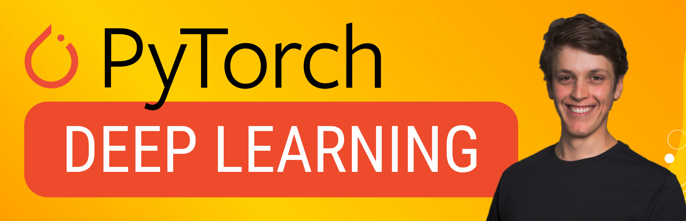

# Beginner Level Deep Learning Tutorials in Pytorch!  
Note that these tutorials expect some knowledge of deep learning concepts. While some of the concepts are explained we are mainly focusing on (in detail) how to implement them in python with Pytorch. 
I have compiled a list of additional resources that cover many of the concepts we look at, the YouTube series section are incredibly valuable! 

[Deep learning google sheets](https://docs.google.com/spreadsheets/d/1WNJmgsVrLqH522yQ47euqAuO83a4WvJe/edit?usp=sharing&ouid=115240163501200760663&rtpof=true&sd=true) 
If you have any good resources let me know and I can add them! 
If you can't find an explaination on something you want to know let me know and i'll try to find it! 
 
<b>Some level of basic Python programming knowledge is expected.</b> 
<b>More sections to come! </b> 
<b>Let me know if you want to see anything else! </b> 

## Help support this work!
<b> Donate here! </b>  

https://www.buymeacoffee.com/lukeditria
 

## Corresponding Videos
[Pytorch Youtube Playlist](https://youtube.com/playlist?list=PLN8j_qfCJpNhhY26TQpXC5VeK-_q3YLPa&si=bMjdMvuVIX8X0yTz) 
[Reinforcement Learning Youtube Playlist](https://youtube.com/playlist?list=PLN8j_qfCJpNg5-6LcqGn_LZMyB99GoYba&si=1HVWNHNQOhw2GrYq) 

Let me know if you want to see a video on any particular section!

## Discord Server
Get help in my [Discord Server](https://discord.gg/8g92X5hjYF) 

## Contents (So Far!)
Section 0 -> Python basics that will be expected knowledge 
Section 1 -> Implementing some basic Machine Learning Algorithms in Python with Numpy 
Section 2 -> Pytorch intro and basics, basic Machine Learning Algorithms with Pytorch 
Section 3 -> Multi-Layer Perceptron (MLP) for Classification and Non-Linear Regression 
Section 4 -> Pytorch Convolutions and CNNs  
Section 5 -> Pytorch Transfer Learning  
Section 6 -> Pytorch Tools and Training Techniques  
#### Applications + Advanced
Section 7 -> Pytorch Autoencoders and Representation Learning  
Section 8 -> Pytorch Bounding Box Detection and Image Segmentation  
Section 9 -> Pytorch Image Generation  
Section 10 -> Pytorch Trained Model Interpretation  
Section 11 -> Pytorch Reinforcement Learning  
#### Sequential Data
Section 12 -> Using Sequential Data  

## Contents (In Progress!)
Section 13 -> All about Attention  

## Contents (To Come!)
Section 14 -> Transformer Time  

## Folder layout:
notebooks -> Tutorials and Skeleton code (Start here) 
solutions -> Skeleton code Solutions 
data -> Data and Images 
